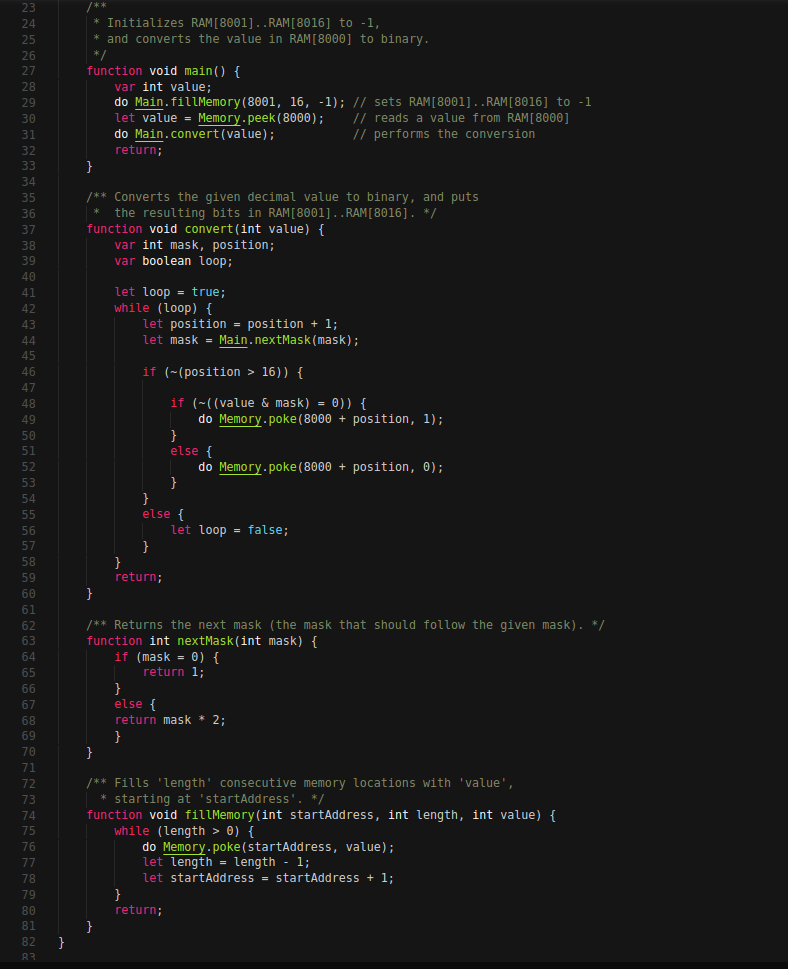

Jack Compiler V1.0
------------------
This is my version of the nand2tetris Jack Compiler. It is created for the Jack programming language, which is an object-oriented language designed for a 16-bit custom built computer. 
It compiles down to VM language, an intermediate representation of the code. See my VM 
Translator repository if you want to see the compiler backend. 

HOW DOES IT WORK?
-----------------

1) Go in your terminal

2) Go to the directory of where the JackCompiler is located

3) Type in "JackCompiler ./Filename/directory" <- Keep in mind that only files with a .jack extension will be compiled.

4) If compilation is successful you should see a .vm file for each .jack file that was compiled, if you notice that one
   or more files are missing that means that something went wrong during compilation.

Do not try to execute a .vm file if there was a compilation error, it will most likely not work. Though you can try anyways.

HOW TO EXECUTE?
---------------

1) Load the VMEmulator (can be downloaded from nand2tetris.org)

2) Load the file/directory into the VMEmulator (If there are multiple vm files, load the entire directory into it)

3) At the top, you'll see a text showing "Animate:", turn it from "Program Flow" to "No Animation" if you want to actually use the
   program.

4) Click the "Run" button (should look like a fast forward icon)

5) Done! :)

